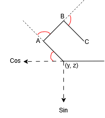

# 3DHand

To run the program simply run the main.py program in your IDE.

# Angle to coordinates calculation

This project takes input data obtained from the visual hand tracking MediaPipe Project and returns a simple finger animation.

Input data is in the form of an angle alpha, which is formed between the line connecting the wrist to the MCP joint and another line from the MCP joint to the finger tip.

For more realistic visualization all the joints are included (i.e. MCP, PIP, DIP).

Considering that angle alpha can be anywhere in the range of 0 to 180~, the range of motion in the MCP, PIP, and DIP has to be adjusted to reflect that.

Therefore, the proposed range of motions are as follows:

    MCP joint with reference to the wrist is set to range from 90 to 180 degrees.
    PIP joint with reference to the MCP joint is set to range from 90 to 180 degrees.
    DIP joint with reference to the PIP joint is set to range from 150 to 180 degrees.

To give an example:

if fingers are fully flexed then the theoretical angle should be 0 degrees, which results in the angles 90, 90 and 150 for the MCP, PIP and DIP joints respectively.

The length of vectors is assumed to be 1 when calculating the angles of the MCP, PIP and DIP joints.

After getting the relative MCP, PIP, and DIP joint angles from angle alpha, the coordinate points are calculated using sine and cosine principles.
The cartesian coordinate system uses the right hand orientation (i.e. positive-z faces the user).

Variable Theta, which stores the cumulative angle of finger flexion, is required to calculate the height (y_coordinate) and depth (z_coordinate) for the PIP, DIP, and tip landmarks.

Applying cosine to Theta yields the height value.

Applying sine to Theta yields the depth value.

The red lines indicate the angle that is to be cumulatively added to Theta variable.

For example, to calculate the coordinates for point A:

    1. determine the theta angle
    2. y-coordinate (height) = cos(theta) + the y-coordinate of Origin
    3. z-coordinate (depth) = cos(theta) + the z-coordinate of Origin
    4. update the Origin coordinates with coordinates of A.
    5. Update Theta variable (cumulatively)

(note the use of positive cosine, that is because for the sake of the diagram simplicity, here the y-coordinate (height) increases from right to left.)

